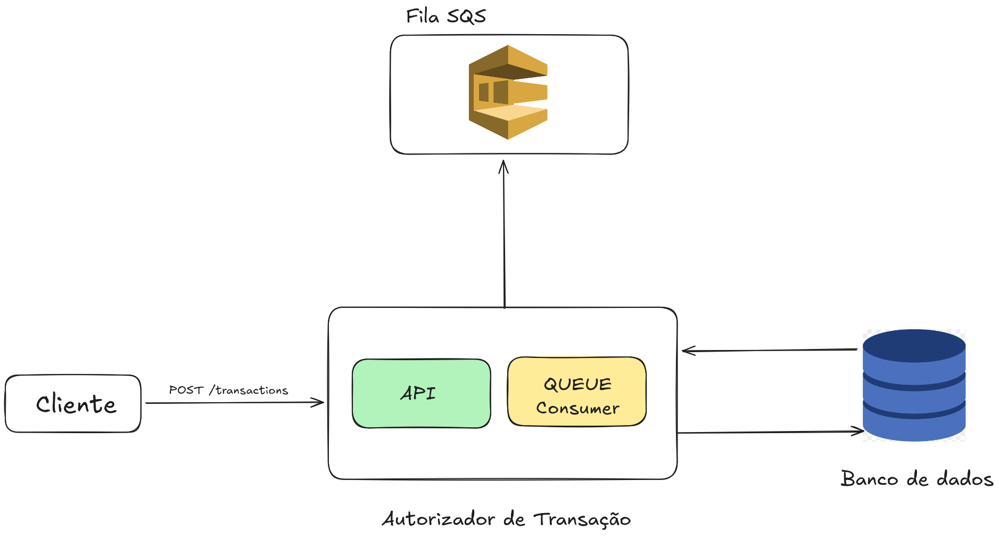

# Transaction Authorization Service

[](https://openjdk.java.net/)
[](https://spring.io/projects/spring-boot)
[](https://www.postgresql.org/)
[](https://aws.amazon.com/sqs/)

## Descrição

API de autorização de transações financeiras desenvolvida para processar operações de crédito e débito em contas bancárias com alta volumetria, disponibilidade e resiliência. O sistema consome mensagens de abertura de contas via AWS SQS e processa transações garantindo consistência e integridade de dados.

Este projeto foi desenvolvido como parte de um desafio técnico para demonstrar habilidades em:
- Desenvolvimento de sistemas financeiros críticos
- Arquitetura limpa e princípios SOLID
- Processamento assíncrono com filas
- Consistência e atomicidade de transações
- Testes automatizados e qualidade de código

## Índice

- [Funcionalidades](#funcionalidades)
- [Arquitetura](#arquitetura)
- [Tecnologias](#tecnologias)
- [Pré-requisitos](#pré-requisitos)
- [Instalação](#instalação)
- [Configuração](#configuração)
- [Uso](#uso)
- [API Endpoints](#api-endpoints)
- [Testes](#testes)

## Funcionalidades

- **Criação de Contas**: Consumo assíncrono de mensagens do AWS SQS para criação de novas contas bancárias
- **Autorização de Transações**: Processamento de operações de crédito e débito via API REST
- **Validação de Saldo**: Rejeição automática de débitos que resultariam em saldo negativo
- **Validação de Moeda**: Suporte apenas para BRL com arquitetura extensível para múltiplas moedas
- **Precisão Monetária**: Armazenamento de valores em centavos para evitar problemas de arredondamento
- **Idempotência**: Prevenção de duplicação de contas na criação
- **Transações Atômicas**: Garantia de consistência através de transações de banco de dados
- **Alta Disponibilidade**: Arquitetura preparada para escalabilidade horizontal

## Arquitetura



### Padrões de Design Utilizados

- **Strategy Pattern**: Operações de crédito e débito implementadas como estratégias intercambiáveis
- **Factory Pattern**: Criação dinâmica de estratégias de operação
- **Repository Pattern**: Abstração da camada de persistência
- **Mapper Pattern**: Conversão entre entidades de domínio e entidades JPA
- **Command Pattern**: Encapsulamento de dados de comandos

Para mais detalhes, consulte a [documentação de arquitetura](docs/architecture/ARCHITECTURE.md).

## Tecnologias

### Core
- **Java 21** - Linguagem de programação
- **Spring Boot 3.5.9** - Framework principal
- **Spring Data JPA** - Camada de persistência
- **Hibernate** - ORM

### Banco de Dados
- **PostgreSQL 17** - Banco de dados relacional

### Mensageria
- **AWS SQS** - Fila de mensagens
- **Spring Cloud AWS 3.2.1** - Integração com AWS
- **LocalStack** - Emulação local de serviços AWS

### Testes
- **JUnit 5** - Framework de testes
- **AssertJ** - Biblioteca de assertions fluentes
- **Spring Boot Test** - Testes de integração

### Build & DevOps
- **Maven** - Gerenciamento de dependências
- **Docker & Docker Compose** - Containerização

## Pré-requisitos

Antes de começar, certifique-se de ter instalado:

- **Docker** e **Docker Compose** ([Download](https://www.docker.com/get-started))
- **AWS CLI** (opcional, para testar a fila SQS) ([Download](https://aws.amazon.com/cli/))
- **Git** ([Download](https://git-scm.com/))

**Nota**: Não é necessário ter Java ou Maven instalados localmente. O build é feito completamente dentro do Docker.

### Verificar instalação

```bash
docker --version         # Deve mostrar Docker 20.10+
docker compose version   # Deve mostrar Compose v2.0+
```

## Instalação

### 1. Clone o repositório

```bash
git clone https://github.com/marqosPrado/transaction-autorization-service.git
cd transaction-autorization-service
```

### 2. Configure as variáveis de ambiente

Crie um arquivo `.env` na raiz do projeto com o seguinte conteúdo:

```bash
ENVIRONMENT=dev

POSTGRES_HOST=database
POSTGRES_PORT=5432
POSTGRES_DB=transactions
POSTGRES_USER=postgres
POSTGRES_PASSWORD=postgres

AWS_REGION=sa-east-1
AWS_ACCESS_KEY_ID=test
AWS_SECRET_ACCESS_KEY=test

AWS_SQS_ENDPOINT=http://localstack:4566/000000000000/
AWS_SQS_QUEUE_NAME=conta-bancaria-criada
```

### 3. Inicie todos os serviços

```bash
docker compose up -d
```

Este comando irá:
1. **Compilar a aplicação**
2. **Criar a imagem Docker** da aplicação
3. **Iniciar todos os serviços**:
   - Transaction Service (porta 8080)
   - PostgreSQL (porta 5432)
   - LocalStack/AWS SQS (porta 4566)
   - Message Generator (gerador de contas)

A aplicação estará disponível em `http://localhost:8080`.

### 4. Verificar status dos serviços

```bash
docker compose ps
docker compose logs transaction-service --tail=50
```

## Configuração

### Fila SQS

**Nome**: `conta-bancaria-criada`
**URL**: `http://localhost:4566/000000000000/conta-bancaria-criada`
**ARN**: `arn:aws:sqs:sa-east-1:000000000000:conta-bancaria-criada`
**Região**: `sa-east-1`

## Uso

### Verificar mensagens na fila (via AWS CLI)

```bash
export AWS_DEFAULT_REGION=sa-east-1
export AWS_ACCESS_KEY_ID=test
export AWS_SECRET_ACCESS_KEY=test

aws --endpoint-url=http://localhost:4566 \
    --region sa-east-1 \
    sqs receive-message \
    --queue-url http://localhost:4566/000000000000/conta-bancaria-criada \
    --max-number-of-messages 10
```

### Criar uma transação via API

**Operação de Crédito:**

```bash
curl -X POST http://localhost:8080/api/v1/transactions \
  -H "Content-Type: application/json" \
  -d '{
    "accountId": "5b19c8b6-0cc4-4c72-a989-0c2ee15fa975",
    "operationType": "CREDIT",
    "amount": 150.00,
    "currency": "BRL"
  }'
```

**Operação de Débito:**

```bash
curl -X POST http://localhost:8080/api/v1/transactions \
  -H "Content-Type: application/json" \
  -d '{
    "accountId": "5b19c8b6-0cc4-4c72-a989-0c2ee15fa975",
    "operationType": "DEBIT",
    "amount": 50.00,
    "currency": "BRL"
  }'
```

## API Endpoints

### POST /api/v1/transactions

Cria uma nova transação de crédito ou débito.

**Request Body:**

```json
{
  "accountId": "uuid",
  "operationType": "CREDIT|DEBIT",
  "value": "100.00",
  "currency": "BRL"
}
```

**Validações:**
- `accountId`: Obrigatório, deve existir no sistema
- `operationType`: Obrigatório, deve ser `CREDIT` ou `DEBIT`
- `value`: Obrigatório, deve ser positivo
- `currency`: Obrigatório, deve ser `BRL` (moedas suportadas) e corresponder à moeda da conta

**Response (201 Created):**

```json
{
  "transaction": {
    "id": "8e8ae808-b154-48b5-9f3e-553935cc4543",
    "type": "CREDIT",
    "amount": {
      "value": 100.00,
      "currency": "BRL"
    },
    "status": "SUCCEEDED",
    "timestamp": "2026-01-09T15:57:55-03:00"
  },
  "account": {
    "id": "5b19c8b6-0cc4-4c72-a989-0c2ee15fa975",
    "balance": {
      "amount": 250.00,
      "currency": "BRL"
    }
  }
}
```

**Possíveis Erros:**

| Status | Código de Erro | Descrição |
|--------|----------------|-----------|
| 400 | `VALIDATION_ERROR` | Moeda não suportada ou campo inválido |
| 404 | `ACCOUNT_NOT_FOUND` | Conta não encontrada |
| 422 | `CURRENCY_MISMATCH` | Moeda da transação diferente da moeda da conta |
| 422 | `INSUFFICIENT_BALANCE` | Saldo insuficiente para débito |

Para mais exemplos e casos de erro, consulte a [coleção de APIs](docs/api/API_COLLECTION.md).

## Testes

O projeto possui cobertura de testes unitários.

### Executar todos os testes

```bash
./mvnw test
```

### Executar testes específicos

```bash
# Testes de débito
./mvnw test -Dtest=AccountDebitTest

# Testes de crédito
./mvnw test -Dtest=AccountCreditTest
```

### Cobertura de Testes

- **AccountDebitTest**: 18 casos de teste cobrindo débitos, validações e edge cases
- **AccountCreditTest**: 11 casos de teste para operações de crédito

Principais cenários testados:
- Operações básicas (crédito/débito)
- Precisão com valores decimais
- Validação de saldo insuficiente
- Valores nulos, zero e negativos
- Múltiplas operações consecutivas
- Operações alternadas (crédito/débito)
- Valores grandes

### Principais Decisões

**1. PostgreSQL como Banco de Dados**
- **Motivação**: ACID completo, suporte a transações robustas, alta confiabilidade
- **Tradeoff**: Menor throughput que NoSQL, mas essencial para consistência financeira

**2. Armazenamento em Centavos**
- **Motivação**: Evitar problemas de precisão de ponto flutuante
- **Tradeoff**: Conversão BigDecimal ↔ Long

**3. Clean Architecture**
- **Motivação**: Separação de responsabilidades, testabilidade, manutenibilidade
- **Tradeoff**: Mais código inicial (mappers, interfaces)

**4. Strategy Pattern para Operações**
- **Motivação**: Extensibilidade para novos tipos de operação (reversão, bloqueio, etc.)
- **Tradeoff**: Complexidade adicional, mas facilita evolução
