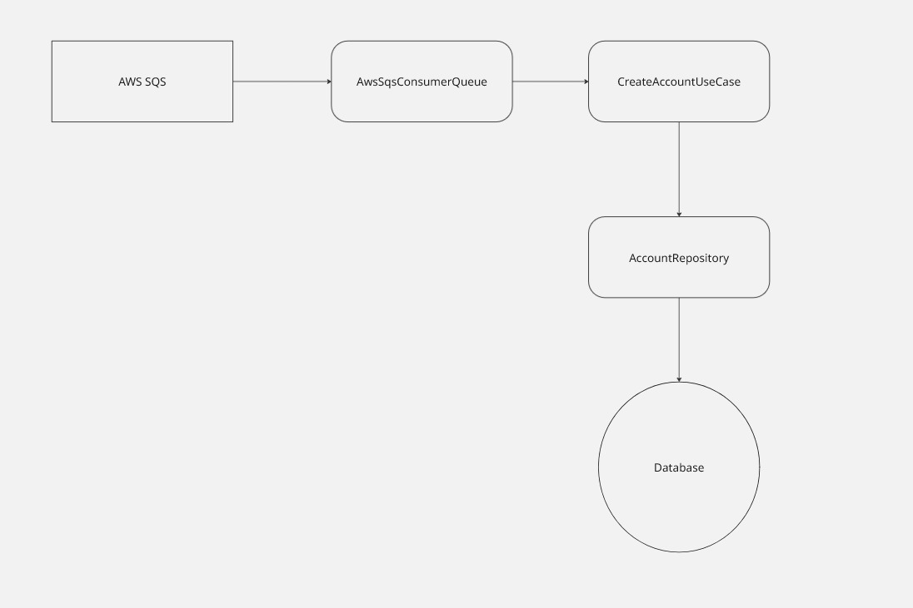
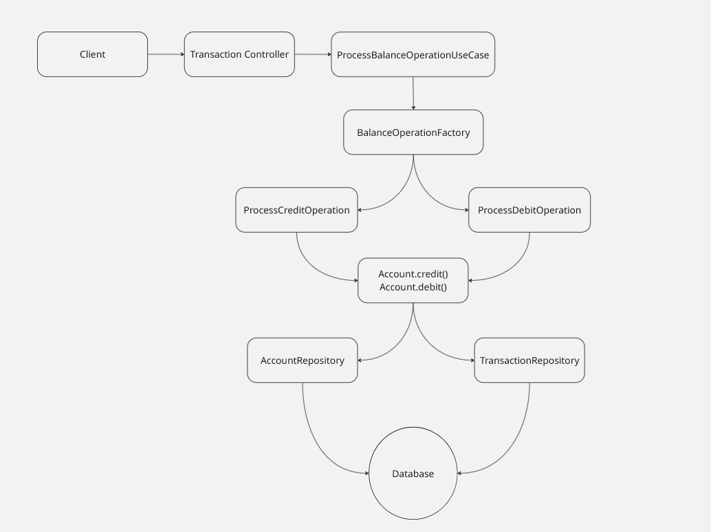

# Arquitetura do Sistema - Transaction Authorization Service

## Visão Geral

O Transaction Authorization Service é uma aplicação de missão crítica projetada para processar transações financeiras com alta volumetria, garantindo consistência, disponibilidade e resiliência. A arquitetura segue os princípios de **Clean Architecture** para maximizar testabilidade, manutenibilidade e independência de frameworks.

## Princípios Arquiteturais

### 1. Separation of Concerns (Separação de Responsabilidades)

Cada camada tem responsabilidades bem definidas:
- **Presentation**: Exposição de APIs e formatação de dados
- **Application**: Orquestração de casos de uso
- **Domain**: Regras de negócio e lógica central
- **Infrastructure**: Detalhes técnicos (persistência, mensageria)

### 2. Dependency Rule (Regra de Dependência)

As dependências fluem sempre para dentro, em direção ao domínio:
```
Infrastructure → Application → Domain
Presentation → Application → Domain
```

O domínio **não conhece** as camadas externas, garantindo isolamento e testabilidade.

### 3. Dependency Inversion (Inversão de Dependência)

Interfaces são definidas nas camadas internas e implementadas nas externas:
- `AccountRepository` (interface no Domain) → `AccountRepositoryImpl` (implementação na Infrastructure)

## Fluxos de Dados

### Fluxo 1: Criação de Conta



### Fluxo 2: Processamento de Transação


